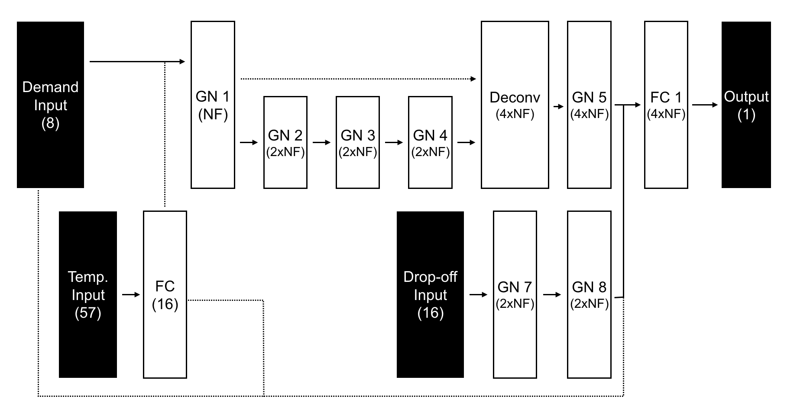
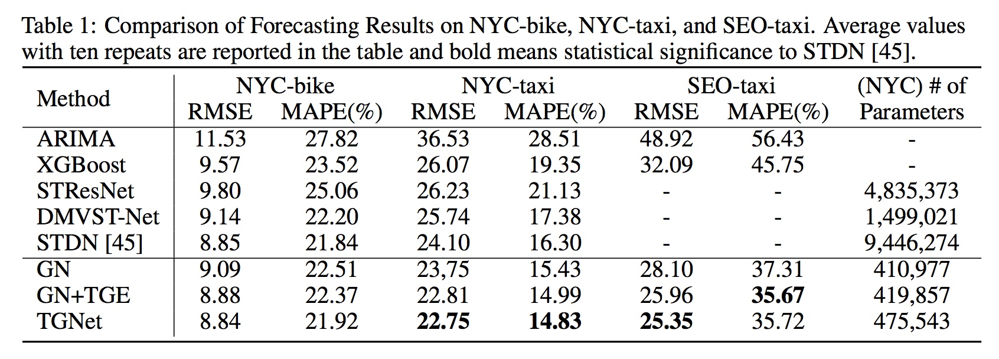
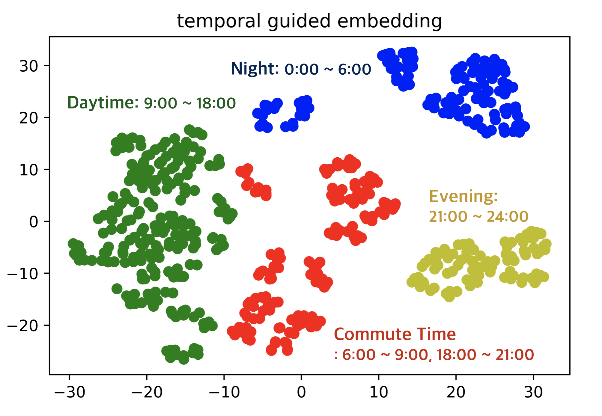
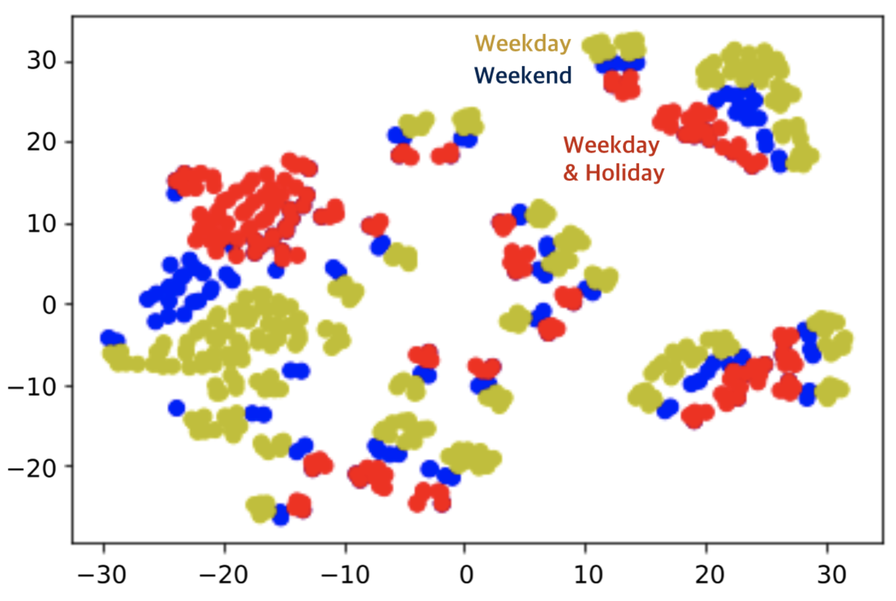
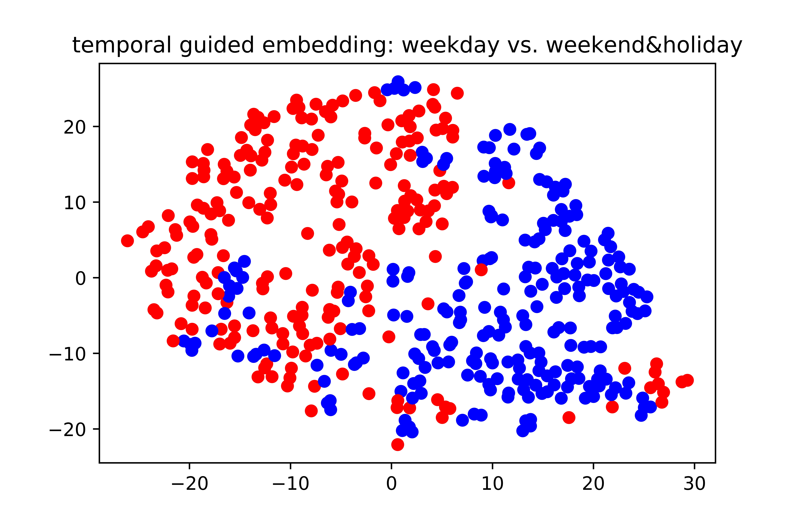

# TGGNet-keras
Author's implementation of TGGNet.  
TGGNet: An efficient baseline for demand forecasting from spatiotemporal data with graph networks and temporal-guided embedding.
Our model has about **20 times smaller number of trainable parameters** than a recent state-of-the-are demand forecasting model, [STDN](https://github.com/tangxianfeng/STDN), and competitive or better performances on NYC datasets.  
We do **not** use external data, such as meteorological data, event information, traffic flow, or news,   
and only focus on efficient extraction of complex spatiotemporal features in past demand patterns.  

If you want to combine external data sources in our model, you can do that.  
After a stack of layers, combine the feature maps by the same manner of drop-off volumes in this model.  

Our model not only learns autoregressive model of ordered sequence, but also **learns temporal contexts explicitly**.  
Finally, TGGNet learns **conditional autoregressive model on temporal contexts** of forecasting-targtar time.
The detail explanation is in our paper [(arxiv)](https://arxiv.org/abs/1905.10709)

## Prerequisites (my environments)
- Python 3.5.2 .
- Tensorflow-gpu 1.7.0 .
- Keras 2.2.2 .
- Pandas 0.22.0 .
- Numpy 1.14.2 .


## Usage
We attach \*Sampler.ipynb files for reference to make dataset.  
We do not open SEO-taxi dataset in original paper.  
First, unzip the dataset.
```
>> unzip dataset.zip
```

## Run Saved Model and Teest
```
>> python main.py --model_name NYC --dataset_name NYC --test --alpha (0.01 or 0.05)
>> python main.py --model_name NYCB --dataset_name NYCB --test --alpha (0.01 or 0.05)
```
If you run the codes, you can check the accuracy with
```
(NYC) RMSE: 22.596, MAPE: 14.7 %  
(NYCB) RMSE: 8.780, MAPE: 22.0 %

```

## Training a Model from Scratch
```
>> python main.py --model_name (model_name) --num_gpu (gpu counts) --dataset_name (NYC or NYCB) --alpha (0.01 or 0.05)
```
In here, alpha means the threshold level of atypical sample selection.    
There are many arguments to change hyper-parameters, see main.py


## TGGNet: Model Description
TGGNet consists 3 components: (a) baseline model (GN), (b) temporal-guided embedding, and (c) late fusion with external data sources.  



Temporal guided embedding learns temporal contexts and helps FCN extract hidden feature maps conditioned on temporal contexts.  
It is similar with the generator in coniditional GAN as we see the forecasting model as generative model.  

You can use external data sources (if you want), encoding in various ways and concatenated into the baseline.  
In TGGNet, we encode taxi drop-off volumes and improve forecasting performances on atypical samples with extremely large volumes.

# Main results
## Forecasting Accuracy
TGGNet shows state-of-the-art performances on real-world datsets and has **20 times smaller** number of parameters.




## Visualization of Temporal Guided Embedding
Temporal-guided embedding explicitly learns temporal contexts in training data.  
If your data is large-scale, Temporal guided embedding shows meaningful and interpretable visualization.  
The results of SEO-taxi dataset (private) are below.

### Visualization Result 1
The basic concept of time-of-day is high correlations between adjacent time.  
Temporal guided embedding can learn the fact, from 0/1 categorical vectors of time-of-day.


### Visualization Result 2
Based on taxi demand patterns, temporal guided embedding classify time-of-day into 4 groups.  

- Night: 0:00 ~ 06:00
- Commute Time: 06:00 ~ 9:00, 18:00 ~ 21:00
- Daytime: 09:00 ~ 18:00
- Evening: 21:00 ~ 24:00




### Visualization Result 3
Temporal guided embedding can learn day-of-week and holiday concept.
Regardless time-of-day, all weekend & hoiday (but not weekend) vectors are adjacent to each other.  
Also, weekend and weekday are totally divided.  



### Visualization Result 4 : NYC-taxi Dataset  
In the case of NYC-taxi, temporal guided embedding does not many meaningful insights, because the dataset is small scale.  
However, the adjacent time-of-day vectors tend to be located in adjacent to.  
In addition, working day and weekend&holiday are divided in the embedding space.




## Citation
If you use our codes or something in paper, please cite our paper.
```
@article{lee2019demand,
  title={Demand Forecasting from Spatiotemporal Data with Graph Networks ans Temporal-Guided Embedding},
  author={Lee, Doyup and Jung, Suehun and Cheon, Yeongjae and Kim, Dongil and You, Seungil},
  journal={arXiv preprint arXiv:1905.10709},
  year={2019}
}
```

## Contact
Doyup Lee (doyup.lee@postech.ac.kr)
